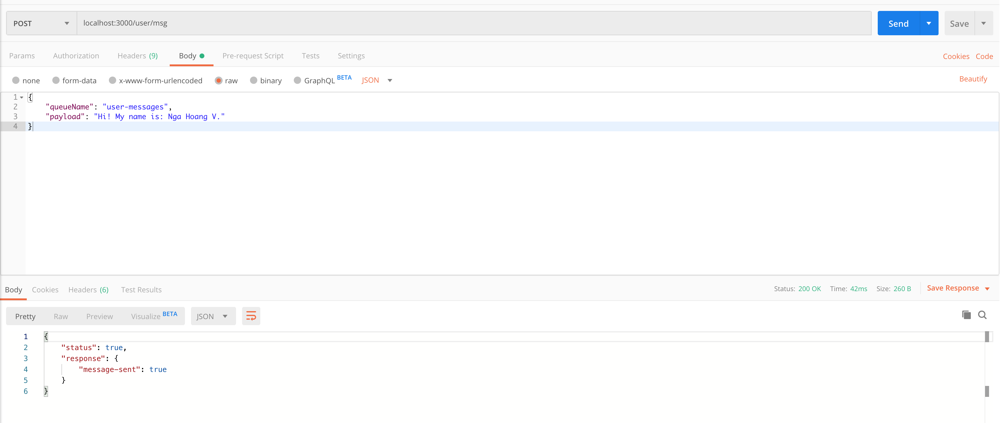
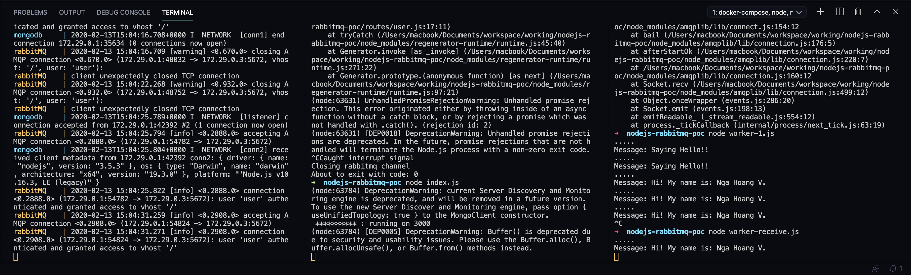

# NodeJS - RabbitMQ PoC

## Require

- Docker - docker-compose
- Node JS

## Start RabbitMQ and MongoDB via docker-compose

```bash
# Run
docker-compose up

# Run with detach mode
docker-compose up -d
```

## Run Sending server

```bash
# install node_modules
npm install

# Run server at localhost:3000
node index.js
```

## Run Receive server

```bash
node worker-receive.js
```

## How to test the code

1. Start RabbitMQ
2. Open RabbitMQ Manager in web browser at ``localhost:15672``
3. Create a new Queues in Tab Queues
4. Run Sending server
5. Run Receive server
6. Open Postman (or another one), access *POST METHOD:* ``localhost:3000/user/msg``, input in raw body:
```json
{
	"queueName": "<NAME_QUEUES>",
	"payload": "Hi! My name is: Nga Hoang V."
}
```
7. Check the message in Receive server





## Reference

- [Medium: Implementing RabbitMQ With Node.js](https://medium.com/better-programming/implementing-rabbitmq-with-node-js-93e15a44a9cc)
- [RabbitMQ tutorial - "Hello World!"](https://www.rabbitmq.com/tutorials/tutorial-one-javascript.html)